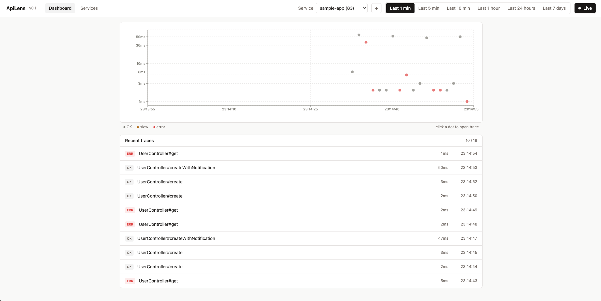
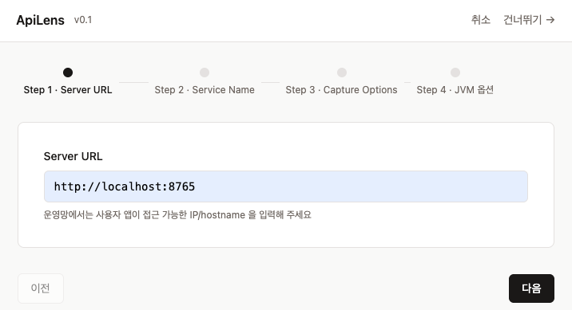
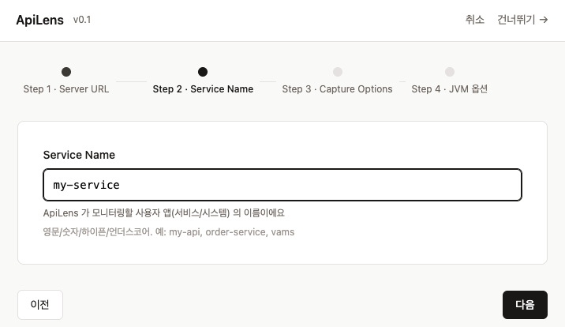
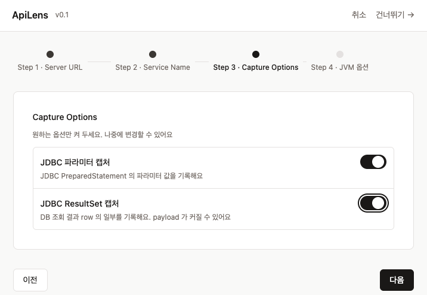
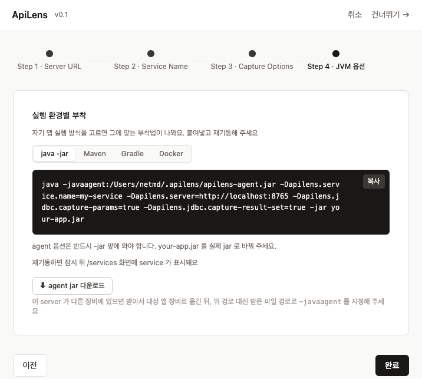
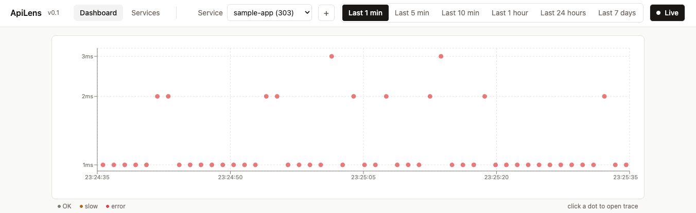
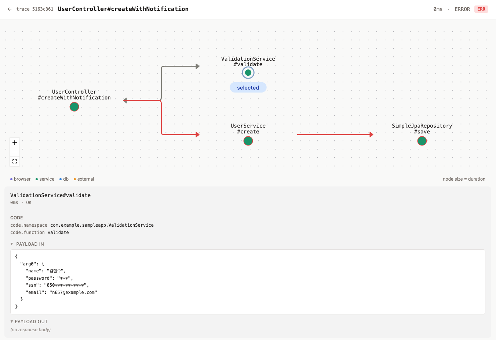

# ApiLens

**Spring Boot 운영자를 위한 가벼운 호출 추적 도구**
*A lightweight call-tracing tool for Spring Boot operators*



---

## 소개 | About

ApiLens는 운영 중인 Spring Boot 애플리케이션의 호출 흐름(controller → service → repository → SQL)과
각 단계의 payload를 한 화면에서 보여주는 가벼운 추적 도구입니다. 코드 수정 없이 `-javaagent:` 옵션
한 줄로 동작하며, 한국 PII(주민등록번호·카드번호 등)를 기본으로 마스킹합니다.

Datadog·Pinpoint 같은 본격 APM의 대체재가 아닙니다 —
**운영자가 결재 없이 직접 깔고 싶은 작은 도구**가 목표입니다.

ApiLens shows the call flow (controller → service → repository → SQL) and the payload at each step
of a running Spring Boot application on a single screen. It attaches with one `-javaagent:` flag — no
code change — and masks Korean PII by default. It is not a full APM replacement like Datadog or
Pinpoint; it is **the small tool an operator wants to install themselves, without sign-off.**

---

## 왜 ApiLens인가 | Why ApiLens

Datadog는 비싸고, Pinpoint는 무겁고, Jaeger는 운영자가 쓰기 어렵습니다.
ApiLens는 그 사이의 좁은 자리, **"지금 이 요청이 어디서 느려졌고 무슨 값으로 DB에 갔는지"를
운영자가 30초 안에 확인하고 싶은 순간**을 위해 만들어졌습니다.

- **한국 SI 운영 환경 정조준** — MyBatis Mapper, HikariCP, MariaDB, air-gapped network까지 고려
- **운영자가 결재 없이 직접** — 단일 jar, 외부 의존 0, 부착은 JVM 옵션 한 줄
- **PII 마스킹 내장** — 주민번호·카드번호를 서버 저장 전에 자동으로 가림 (평문이 ApiLens에 남지 않음)
- **운영에서 검증** — 개발자가 자신의 운영 시스템에 직접 부착해 **60,000+ trace**를 흘리며
  호스트 영향을 일으키는 P0 이슈를 잡아낸 뒤 출시했습니다 ([CHANGELOG](./CHANGELOG.md) 참조)

This tool lives in the narrow gap between expensive APMs and heavy distributed tracers, tuned for the
moment a Korean SI operator wants to know — within 30 seconds — *where this request slowed down and
what value actually hit the database.* It has been dogfooded against a live production system
(60,000+ traces) before release.

---

## 주요 기능 | Features

| 기능 | 설명 |
|------|------|
| 🔌 무중단 부착 | 코드 수정 0줄. `-javaagent:` 한 줄로 부착 (ByteBuddy premain) |
| 🧭 노드 그래프 추적 | controller → service → repository → SQL 흐름을 mind-map 형태로 시각화 (gantt chart 아님) |
| 📦 payload 캡처 | 각 노드의 요청/응답 본문 + JDBC 파라미터·결과셋을 단계별로 확인 |
| 🗂️ MyBatis 지원 | `@Mapper` 인터페이스 호출을 한 점(`MapperProxy`)으로 자동 추적 |
| 🛡️ PII 마스킹 내장 | 주민번호·카드번호·password/token 등 기본 룰을 server-side 에서 자동 마스킹 + 룰 관리 UI·라이브 프리뷰 + 악성 정규식(ReDoS) 저장 차단 |
| 🔐 API Key 인증 (선택) | 관리·조회 API 에 `Authorization: Bearer` 토큰 검증 — 켜면 설정·삭제·조회를 보호, agent 적재(`/v1/spans`)는 면제. 미설정 시 무인증(v0.2 호환) |
| 🔴 에러 즉시 표시 | 끊긴 노드가 빨갛게 멈추고 옆에 stack trace 박스 |
| 📊 응답시간 대시보드 | 시간축 산점도 + 서비스별 필터 + status·operation 검색 + Live 모드 |
| ⚙️ 설정 페이지 | 보관 기간(기본 30일 — 초과 trace 는 매일 04:00 자동 정리)과 마스킹 룰을 브라우저에서 관리 |
| 🧹 디스크 최적화 | 데이터를 지우지 않고 SQLite `VACUUM` 으로 DB 파일의 빈 공간을 회수 — 설정 페이지 버튼 (수동) |
| 🧙 Setup 마법사 | 브라우저에서 옵션을 고르면 부착용 JVM 옵션 한 줄을 만들어 줌 |
| 📕 단일 jar 배포 | agent + collector + storage + UI 가 하나의 jar |
| 🧩 표준 호환 | W3C Trace Context (`traceparent`) + OpenTelemetry 호환 span 모델 |

- **백엔드 | Backend**: Java 21 (21~25 호환) · Spring Boot 3.x · SQLite + Flyway
- **에이전트 | Agent**: ByteBuddy + premain — 모든 의존성을 `io.apilens.agent.shaded.*` 로 relocate 하여 호스트 앱과 클래스 충돌 0
- **UI**: React + Vite + TypeScript (단일 jar 안에 임베드)

---

## 스크린샷 | Screenshots

**Setup Wizard** — 운영 중인 프로젝트에 손쉽게 적용하기 위한 4단계 마법사

| Step 1 | Step 2 | Step 3 | Step 4 |
|---|---|---|---|
|  |  |  |  |

**Dashboard** — 시간축 응답시간 산점도 + 서비스별 필터 + Live 모드



**Trace Detail** — 노드 그래프(mind-map) + payload inspector(마스킹 적용) + 에러 시 stack trace



---

## 빠른 시작 | Quick Start

```bash
# 1. ApiLens server 실행 (포트 8765 — 앱이 보통 쓰는 8080 회피, ./apilens.db 자동 생성)
java -jar apilens-server-<version>.jar

# 2. 브라우저로 열고 Setup wizard 따라가기
#    (server URL · service 이름 · 캡처 옵션을 고르면 부착용 JVM 옵션 한 줄을 만들어 줍니다)
open http://localhost:8765

# 3. 자기 Spring Boot 앱에 agent 부착 후 재기동
java -javaagent:/path/to/apilens-agent.jar \
     -Dapilens.server=http://localhost:8765 \
     -Dapilens.service.name=my-app \
     -jar my-app.jar

# 운영망에서는 localhost 대신 ApiLens server가 떠 있는 박스의 IP/hostname 을 적습니다.
#   -Dapilens.server=http://10.0.1.50:8765
```

첫 trace는 보통 **1~2초 안에** 대시보드에 나타납니다. 30초가 지나도 보이지 않으면
Setup wizard의 마지막 단계 안내(옵션 키 오타·네트워크 도달 가능성)를 다시 확인하세요.
agent jar는 server 첫 실행 시 `~/.apilens/` 에 자동으로 풀리며, Setup wizard가 절대경로 또는
다운로드 링크를 안내합니다.

> **server ≠ app 인 경우** (NAS·별도 박스에 ApiLens를 띄우는 일반적인 운영 구성):
> Setup wizard Step 4 에서 agent jar 다운로드 링크를 제공합니다. 사용자 앱이 있는 박스로
> jar를 내려받아 부착하세요.

Run the server, open the wizard in your browser, paste the generated `-javaagent:` line into your
app, and restart — the first trace usually appears within a second or two.

---

## 직접 빌드 | Build from Source

```bash
# 요구사항 | Requirements: JDK 21, Node 20+ (Gradle wrapper 포함)

git clone https://github.com/NetMD/ApiLens.git
cd ApiLens

# UI 빌드 (선택 — 미빌드 시 server는 경고만 띄우고 정상 기동)
cd apilens-ui && npm ci && npm run build && cd ..

# 전체 빌드 (agent shadow jar + server bootJar + UI 임베드)
./gradlew clean build
```

산출물 | Output:
- `apilens-server/build/libs/apilens-server-<version>.jar` — 단일 배포 jar (server + UI)
- `apilens-agent/build/libs/apilens-agent-<version>.jar` — 사용자 앱에 부착하는 agent jar

---

## PII 마스킹 | PII Masking

server-side 마스킹 엔진이 모든 payload 를 **저장 전에** 기본 룰로 자동 마스킹합니다.
평문 PII가 ApiLens 저장소(SQLite)에 남지 않는 것이 설계 원칙입니다 (v0.1 내장, ingest 시 적용).

**값 패턴 (regex) — 부분 마스킹**

| 룰 | 패턴 |
|---|---|
| 주민등록번호 | `\d{6}-?\d{7}` |
| 신용카드번호 | `\d{4}-?\d{4}-?\d{4}-?\d{4}` (16자리 / Luhn 검증은 향후 버전) |

**키 이름 (field name) — 값 전체 마스킹 (`***`)**

JSON payload 의 키 이름이 아래와 정확히 일치하면(대소문자 구분) 그 값을 통째로 가립니다.

| 그룹 | 마스킹되는 키 |
|---|---|
| password | `password` · `passwd` · `pwd` |
| token / secret | `token` · `secret` · `authorization` · `apikey` · `api_key` · `api-key` |

> ⚠️ **JDBC 파라미터 마스킹 한계 — 반드시 확인하세요**
>
> JDBC 파라미터는 **위치 번호를 키로** 캡처됩니다 (`{"1": "...", "2": "..."}`). 따라서
> 키 이름 기반 마스킹(password/token 등)은 **JDBC 단에서는 동작하지 않습니다.** 값 패턴
> 기반 룰(주민번호·카드번호)은 JDBC 단에서도 정상 마스킹됩니다.
>
> SQL 파라미터에 민감 값이 들어갈 가능성이 있다면, 캡처 자체를 끄는 것이 가장 안전합니다:
>
> ```
> -Dapilens.jdbc.capture-params=false   # JDBC 파라미터 캡처 비활성 (advice weaving 자체 skip)
> ```
>
> 컬럼 이름 추적 기반 보강이 차기 release 후보로 등재되어 있습니다 (agent 모듈을 바꾸는 라운드로 이월).

룰 추가/삭제·토글과 라이브 프리뷰는 v0.2 부터 설정 페이지(`/settings`)에서 제공됩니다.
default 룰 4종(주민번호·카드번호·password·token)은 삭제 불가이며 비활성 토글만 가능합니다.
룰 변경은 변경 이후 수집분부터 적용됩니다 (기존 저장 payload 의 재마스킹 없음).

---

## Agent 안전성 | Agent Safety

운영자가 agent에게 가장 먼저 묻는 질문은 "이거 붙였다가 우리 앱 죽는 거 아니냐"입니다.
ApiLens agent는 **호스트 앱 영향 0** 을 설계 목표로 삼았고, 실제 운영 환경 dogfooding을 통해
이를 검증·교정했습니다.

- **3중 방어** — advice의 try-catch silent drop + 직렬화 위험 클래스 차단 + 리소스 핸들 가드.
  agent 내부에서 무슨 일이 일어나도 예외가 호스트 호출 경로로 새지 않습니다.
- **의존성 격리** — 모든 라이브러리를 `io.apilens.agent.shaded.*` 로 relocate.
  호스트 앱의 ByteBuddy·Jackson 버전과 충돌하지 않습니다.
- **즉시 끄기** — 운영 중 의심스러우면 `-Dapilens.jdbc.capture-params=false` 또는
  agent 옵션 제거 후 재기동으로 추적을 즉시 중단할 수 있습니다.

실제 운영 시스템 dogfooding에서 발견한 호스트 영향 P0 이슈(예: 결과셋 캡처가 호스트 파일을
truncate, NULL 처리 분기가 호스트 기동을 막던 문제)는 **모두 v0.1.0 출시 전에 잡혔습니다.**
자세한 내역은 [CHANGELOG](./CHANGELOG.md)를 참조하세요.

---

## 인증 | Authentication (v0.3+)

기본은 **무인증**입니다 — 토큰을 설정하지 않으면 v0.2 와 똑같이 동작하므로 기존 환경이 그대로 호환됩니다. 관리·조회 API 를 보호하려면 server 기동 시 **API Key 토큰**을 설정하세요. 토큰을 켜면 `/v1/**` 관리·조회 API(설정·마스킹 룰·데이터 관리·trace 조회 등)는 `Authorization: Bearer <토큰>` 헤더를 요구합니다.

> ⚠️ **신뢰 네트워크 전제 도구입니다.** 토큰은 평문(HTTP)으로 전송됩니다. 운영망/방화벽 격리 환경에서만 쓰고, 공용망에 노출할 때는 리버스 프록시(nginx 등)로 TLS 를 종단하세요.

### 1. 토큰 만들기

```bash
# 충분히 긴 랜덤 토큰을 하나 생성 (예시)
openssl rand -hex 32
#  → 7f3a9c2e8b1d4f6a0c5e9b2d7a4f1c8e3b6d9a2f5c8e1b4d7a0c3e6b9d2f5a8c
```

### 2. server 기동 시 토큰 설정

```bash
# 방법 A — 환경변수 (운영 권장)
export APILENS_AUTH_API_KEY="여기에-생성한-토큰"
java -jar apilens-server-<version>.jar

# 방법 B — 한 줄로 (inline 환경변수)
APILENS_AUTH_API_KEY="여기에-생성한-토큰" java -jar apilens-server-<version>.jar

# 방법 C — 시스템 프로퍼티 (env 보다 우선)
java -Dapilens.auth.api-key="여기에-생성한-토큰" -jar apilens-server-<version>.jar

# 방법 D — Docker
docker run -e APILENS_AUTH_API_KEY="여기에-생성한-토큰" -p 8765:8765 <image>

# 토큰을 설정하지 않으면? → 무인증으로 기동 (v0.2 동일) + 기동 시 경고 로그 1회
```

### 3. 브라우저(UI)에서 사용

토큰을 켠 server 에 브라우저로 접속하면 조회가 401 로 막히고 토큰 입력을 안내합니다. 설정 페이지(`/settings`)에서 토큰을 입력하면 브라우저 세션(`sessionStorage`)에 저장되고, 이후 모든 요청에 자동으로 헤더가 붙습니다. (브라우저 탭을 닫으면 토큰도 지워집니다 — 재접속 시 다시 입력.)

### 4. API 직접 호출 (curl · 스크립트)

```bash
# 토큰 없이 → 401
curl http://localhost:8765/v1/traces
#  → {"error":"unauthorized"}

# 토큰 헤더로 → 200
curl -H "Authorization: Bearer 여기에-생성한-토큰" http://localhost:8765/v1/traces

# 스크립트에서는 환경변수로 깔끔하게
export APILENS_TOKEN="여기에-생성한-토큰"
curl -H "Authorization: Bearer $APILENS_TOKEN" http://localhost:8765/v1/traces
```

### 면제 경로 (토큰 없이도 동작)

토큰을 켜도 아래 경로는 인증에서 **제외**됩니다:

- **agent 적재** (`POST /v1/spans`) — agent 모듈을 바꾸지 않기 위한 선택입니다. **토큰을 켜도 NAS·원격 agent 의 trace 적재는 끊기지 않습니다.**
- **Setup wizard** (`/v1/setup/**`) · **헬스체크** (`/actuator/health`) · **정적 화면·자산** (`/`, `/index.html`, `/assets/**`)

### 키 교체

토큰은 DB 에 저장하지 않고 server 기동 옵션으로만 둡니다. 키를 바꾸려면 **새 토큰으로 server 를 재시작**하세요.

> Authentication is **opt-in**. Set `APILENS_AUTH_API_KEY` (env) or `-Dapilens.auth.api-key` (system property) to require a `Authorization: Bearer <token>` header on management/query APIs. The agent ingest endpoint (`POST /v1/spans`), setup wizard, health check, and static assets are exempt. Without a token the server runs unauthenticated (same as v0.2) with a one-time warning. Token travels over plain HTTP — keep it on a trusted network or terminate TLS with a reverse proxy.

---

## 유지보수 모드 (수신 일시정지) | Maintenance Mode (v0.3.1+)

디스크 최적화(VACUUM)·정리는 SQLite write 잠금을 점유합니다. 적재(ingest)가 계속 들어오는 동안 정리하면 잠금 경합(`SQLITE_BUSY`)으로 부분 실패할 수 있습니다. **유지보수 모드**는 운영 중인 서비스를 멈추지 않고 **collector 의 적재만 잠시 끊어** 정리를 잠금 경합 없이 끝내게 해줍니다.

- 설정 페이지(`/settings`)의 "데이터 관리" 섹션에서 **[수신 일시정지]** 버튼을 누르면 수신이 멈춥니다. 정리(최적화·삭제)가 끝나면 **[수신 재개]** 버튼으로 다시 켜세요.
- 일시정지 중에는 화면 상단에 배너("수신 일시정지 중 — 이 동안 들어온 데이터는 저장되지 않습니다")가 뜨고, 대시보드 실시간 갱신이 멈춥니다.
- 일시정지 중 들어오는 trace 는 server 가 **503 으로 거부**하며 **저장되지 않습니다**. agent 는 해당 batch 를 drop 합니다.
- **켜둔 채 잊어도 30분 뒤 자동으로 재개**됩니다 (안전장치). 유지보수는 수 분 내 짧게 끝내고 즉시 재개하는 것을 전제로 합니다.
- 상태는 메모리에만 두므로 **server 를 재시작하면 항상 수신 중(false)으로 복귀**합니다 (DB 에 저장하지 않음).

> **Maintenance mode** lets you pause ingest (without stopping your monitored services) so disk optimization (VACUUM) and cleanup run without write-lock contention. Toggle it from the "데이터 관리" section on `/settings`. While paused, `POST /v1/spans` returns `503 Retry-After: 60` and incoming traces are **not stored**. A 30-minute max-pause cap auto-resumes ingest if you forget. The state is in-memory only — a server restart always resumes ingest.

---

## v0.3 한계 | v0.3 Limitations

투명하게 적어둡니다. 운영 도입 결정 시 참고하세요.
(v0.3 은 server·UI 중심 릴리스 — 인증·ReDoS 가드·온라인 VACUUM. agent 모듈은 변경이 없어 agent 쪽 한계는 v0.1 과 동일합니다.)

- **단일 서비스 추적** — 서비스 간 분산 trace 연결(MSA)은 향후 예정 (아래 로드맵)
- **동기 호출만** — `@Async` / WebFlux 비동기 경로는 차기 agent 업데이트로 이월
- **메서드 파라미터 이름이 `arg0`·`arg1`…** — 모든 인자를 캡처하지만, 사용자 앱이 `-parameters` 컴파일 옵션 없이 빌드되면 파라미터 이름 대신 인덱스로 표시됩니다. `-parameters` 로 빌드하면 실제 이름이 나타납니다. 차기 agent 업데이트로 이월
- **JDBC 파라미터 키 이름 마스킹 한계** — 위 [PII 마스킹](#pii-마스킹--pii-masking) 경고 참조
- **인증은 선택적, TLS 미내장** — v0.3.0 에서 API Key 인증이 추가됐습니다 (위 [인증](#인증--authentication-v03) 섹션). 다만 토큰은 평문(HTTP)으로 전송되고 agent 적재 경로(`/v1/spans`)는 무인증 면제이므로 **여전히 신뢰 네트워크 전제**입니다. 공용망 직접 노출 금지 — TLS 가 필요하면 리버스 프록시로 종단하세요
- **마스킹 ReDoS 가드는 신규 룰 저장 시점만 검사** — 악성 정규식은 룰을 저장할 때 차단되지만, 이미 저장된 룰이나 적재된 payload 가 마스킹을 거치는 경로는 가드 대상이 아닙니다. 근본 차단(공유 엔진의 linear-time 매칭)은 차기 agent 라운드로 이월
- **대용량 단일 trace 의 적재 잠금 경합** — 한 trace 가 수만 개의 span 을 만드는 과잉 계측 환경에서는, 단일 트랜잭션의 대량 INSERT 가 SQLite write 잠금을 오래 점유해 동시에 들어오는 다른 trace 가 일시적으로 거부(`SQLITE_BUSY`)될 수 있습니다. v0.3.1 의 [유지보수 모드](#유지보수-모드-수신-일시정지--maintenance-mode-v031)로 정리 중 잠금 경합은 회피할 수 있고, 적재 자체의 계측량 제어는 차기 agent 라운드로 이월

---

## 향후 예정 | Roadmap

순서와 범위는 바뀔 수 있습니다. Subject to change.

- **유지보수 모드 (수신 일시정지)** — ✅ **v0.3.1 출시 완료**. 운영 중인 서비스를 멈추지 않고 collector 의 적재만 잠시 끊어, 디스크 최적화(VACUUM)·정리를 잠금 경합 없이 수행. 위 [유지보수 모드](#유지보수-모드-수신-일시정지--maintenance-mode-v031) 섹션 참조
- **계측량 제어 + 거대 trace 완화** — agent 의 패키지 include/exclude 필터·최소 duration 필터로 과잉 계측을 줄여 용량·잠금 경합을 근본적으로 낮추고, server 는 대형 span 배치를 청크로 나눠 커밋
- **멀티 서비스 분산 추적 (MSA)** — `traceparent` 전파 기반 cross-service trace 연결. 단일 서비스 추적 한계 해소
- **인증 보강** — TLS 종단·ingest 토큰·세션 기반 인증 (v0.3.0 API Key 인증의 후속)
- **API 문서 자동화 (OpenAPI/Swagger UI)** — 손으로 쓰는 API 문서를 코드 생성으로 전환하고, `/swagger-ui` 인터랙티브 문서를 단일 jar 에 임베드 (server 전용 — agent 무관). 문서가 코드와 어긋나지 않도록 하는 게 목적
- **agent 보강 후보** — JDBC 파라미터 이름 기반 마스킹(컬럼 이름 추적), `java.time` 타입 직렬화 확장, `@Async` 비동기 경로, 공유 마스킹 엔진의 ReDoS 근본 차단 ([CHANGELOG](./CHANGELOG.md) Unreleased 후보 참조)

---

## 문서 | Documentation

- **[API 계약](./docs/api.md)** — 5개 엔드포인트의 요청/응답 계약, 인증, 유지보수 모드(수신 일시정지) API, 마스킹 동작. | REST API reference.
- **[Agent 옵션](./docs/agent-options.md)** — agent 부착 시 JVM 시스템 프로퍼티 명세. | Agent JVM system properties.
- **[설치·설정 가이드](./docs/setup.md)** — 설치 마법사·서비스 등록·인증·헬스 체크. | Setup guide.
- **[Span attribute 키](./docs/otel-attributes.md)** — OpenTelemetry semantic conventions 기반 span 속성 키. | Span attribute keys.
- **[변경 이력](./CHANGELOG.md)** — 버전별 변경 사항. | Changelog.

> API 문서는 향후 OpenAPI/Swagger UI 자동 생성으로 전환을 검토 중입니다 ([CHANGELOG](./CHANGELOG.md) Unreleased 참조). | A generated OpenAPI/Swagger UI is on the roadmap.

---

## 라이선스 | License

[Apache License 2.0](./LICENSE). 무료 오픈소스입니다 (donation only).
Free and open source under the Apache 2.0 License.

---

## 기여 | Contributing

버그 리포트·기능 제안·PR 모두 환영합니다.
특히 다양한 운영 환경(WAS·DB·프레임워크 조합)에서의 부착 경험 리포트가 큰 도움이 됩니다.

Bug reports, feature requests, and PRs are all welcome — attachment reports from diverse
production environments (WAS / DB / framework combinations) are especially valuable.

---

## 개발자 | Developer

1인 개발자로, 개발자와 운영자를 위한 작고 유용한 도구들을 만들고 있습니다.
Solo developer building small, useful tools for developers and operators.

- 이전 프로젝트 | Previous project: **LogLens** — Spring Boot 로그 분석 데스크탑 앱
